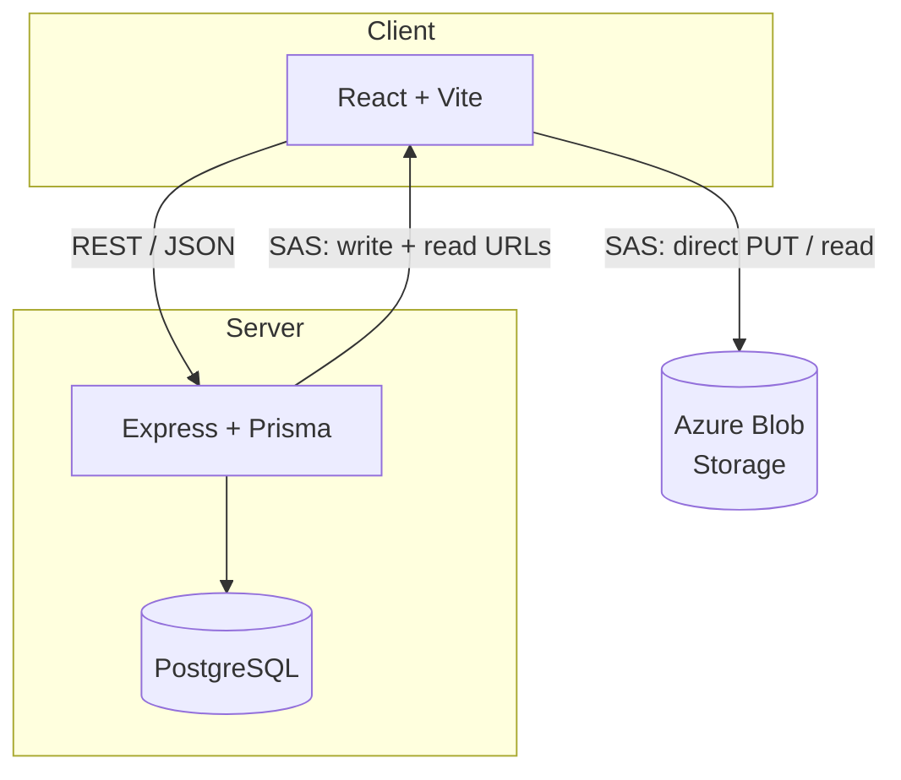

# Horizon

A project and asset management platform — the visual decision making platform.

Built as a demonstration of full-stack engineering capability across a domain I spent time understanding before writing a line of code.

---

## Progress

### Backend

- [x] Express + TypeScript server
- [x] Prisma ORM + PostgreSQL schema
- [x] Docker + docker-compose setup
- [x] Database seeded with realistic domain data
- [x] `GET /api/projects` — list with client and counts
- [x] `GET /api/projects/:id` — full detail with assets, team, activity
- [x] `POST /api/projects` — create with validation
- [x] `PATCH /api/projects/:id` — status update with transaction and enum validation
- [x] `GET /api/clients` — list with project counts
- [x] `GET /api/activity` — recent feed with user and project context
- [x] `GET /api/analytics` — five parallel aggregations in one call
- [x] `POST /api/assets/sas-token` — generate Azure SAS URL
- [x] `POST /api/assets` — save asset record after upload

### Frontend

- [x] Vite + React + TypeScript scaffold
- [x] React Router setup
- [x] shadcn + Tailwind configured
- [x] Dashboard page — project cards, analytics summary, activity feed
- [x] Project detail page — assets, team members, activity timeline, status update
- [x] API integration — all pages connected to backend
- [x] Responsive layout

### Infrastructure

- [x] PostgreSQL in Docker
- [x] Express API in Docker
- [x] Frontend in Docker
- [x] Full stack `docker compose up` working
- [x] Azure Blob Storage connected
- [x] SAS token direct upload to Azure Blob for large 360° renders

### Polish

- [x] README completed
- [x] Architecture decisions documented

---

## Architecture Decisions

- **PostgreSQL over a document database** — The domain is relational: projects belong to clients, users belong to many projects, assets belong to projects. Foreign keys, joins, and aggregations are a natural fit.

- **ProjectUser as a join table** — Projects have many members and members can be on many projects. A join table models many-to-many cleanly and enforces uniqueness with a composite primary key (you cannot add the same user to the same project twice).

- **ActivityLog stores both `projectId` and `userId`** — Supports three query patterns without expensive joins: all activity on a project, all activity by a user, and activity grouped by day for analytics charts.

- **Status updates wrapped in a transaction** — The project update and activity log row either both succeed or both fail. A status change without an audit record would be inconsistent.

- **Analytics endpoint uses `Promise.all`** — Five aggregations run in parallel; response time is bounded by the slowest query, not the sum of all five.

- **SAS tokens instead of server-side uploads** — Large 360° renders routed through the API would bottleneck. SAS tokens let the client upload directly to Azure Blob; the API only persists metadata.

- **Read SAS tokens stored with one-year expiry** — Assets must remain viewable long after upload. Persisting a long-lived read URL at upload time avoids extra backend round-trips to render assets in the UI.

High-level system shape:



## Tech Stack

| Layer          | Technology                                       |
| -------------- | ------------------------------------------------ |
| Frontend       | React, TypeScript, Vite, shadcn/ui, Tailwind CSS |
| Backend        | Node.js, Express, TypeScript                     |
| ORM            | Prisma                                           |
| Database       | PostgreSQL                                       |
| Storage        | Azure Blob Storage                               |
| Infrastructure | Docker, docker-compose                           |

---

## Running Locally

```bash
# start all containers
docker compose up --build

# seed the database
cd backend && npm run db:seed
```

API runs on `http://localhost:4000`
Frontend runs on `http://localhost:3000`

---

## Schema Overview

Five core models:

- **Client** — design firm clients (Australia Post, Brickworks etc)
- **Project** — engagements with a client, status tracked through lifecycle
- **Asset** — renders, site scans, documents uploaded per project
- **ProjectUser** — many-to-many join between projects and team members
- **ActivityLog** — event log powering the activity feed and analytics

Key decisions:

- `ProjectUser` as a join table enables many-to-many without duplication
- `ActivityLog` stores both `projectId` and `userId` enabling per-project and per-user activity queries
- Status updates wrapped in `$transaction` with activity log creation for data integrity
- Analytics endpoint uses `Promise.all` for parallel queries — one request, five aggregations

---

## What I'd Build Next

- [ ] Row Level Security (RLS) at the database level for true multi-tenant data isolation
- [ ] JWT authentication with user sessions
- [ ] Pagination on activity logs and asset grids
- [ ] GitHub Actions CI/CD pipeline deploying to Azure App Service on merge to main
- [ ] Per-project analytics chart — activity over time using raw SQL aggregation
